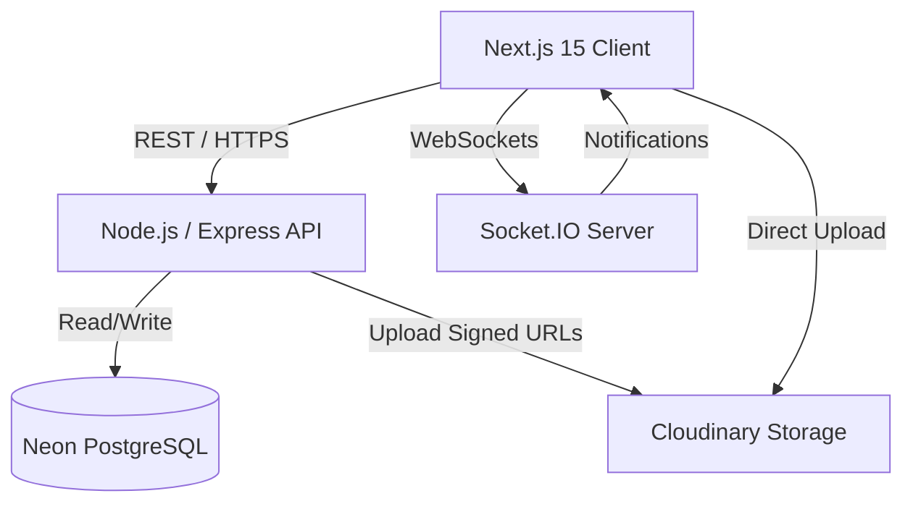

# System Architecture

## Overview
Symbio utilizes a modern, decoupled architecture designed for scale, real-time performance, and strict multi-tenant data isolation.

## High-Level Components

### 1. Client (Frontend)
- **Framework:** Next.js 15 (App Router)
- **Data Fetching:** TanStack Query for client-side state, Server Actions for mutations.
- **Real-Time:** Subscribes to Socket.IO events for live UI updates.

### 2. API Server (Backend)
- **Framework:** Node.js with Express.
- **Role:** Exposes RESTful endpoints, handles business logic, and enforces security.
- **Middleware:** Robust middleware layer for authentication, tenant resolution (`orgId`), and RBAC validation.

### 3. Real-Time Server
- **Technology:** Socket.IO integrated alongside the Express server.
- **Role:** Emits events (e.g., `task.updated`, `notification.new`) strictly to authenticated, tenant-scoped rooms.
- **Scalability:** Designed to use a Redis adapter for multi-instance deployments.

### 4. Database Layer
- **Engine:** PostgreSQL hosted on Neon (serverless Postgres).
- **ORM:** Prisma, providing type-safe queries and schema migrations.

### 5. Storage Layer
- **Provider:** Cloudinary.
- **Role:** Manages user avatars and secure file attachments.

## Architecture Diagram

## Folder Structure
- `/frontend`: Contains the Next.js application, React components (`shadcn/ui`), and hooks.
- `/backend`: Contains the Express application, controllers, services, Prisma schema, and Socket.IO handlers.
