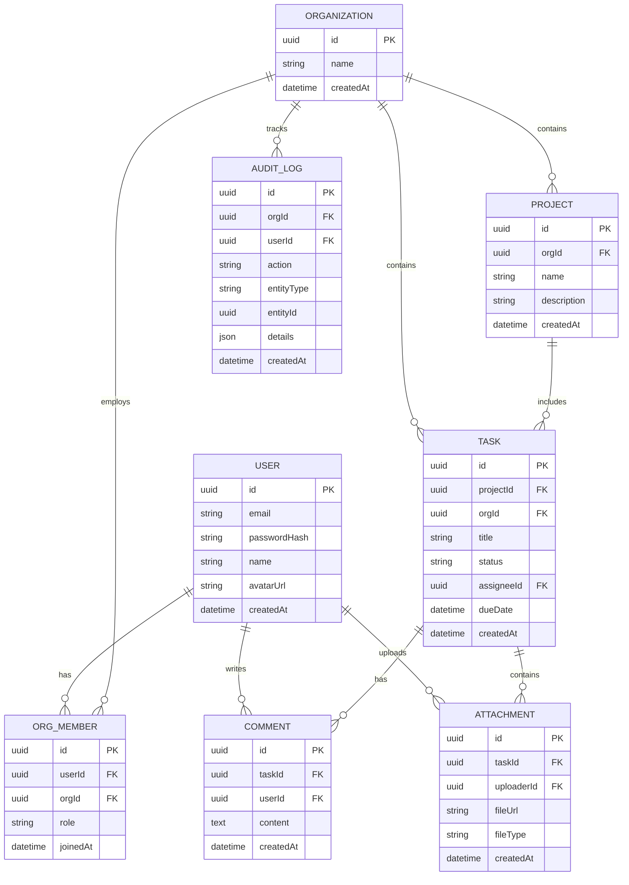

# Entity-Relationship (ER) Diagram

## Overview
This diagram illustrates the conceptual database schema for Symbio, highlighting the relational structure and the pervasive use of `orgId` to ensure tenant data isolation.

## Schema Diagram

