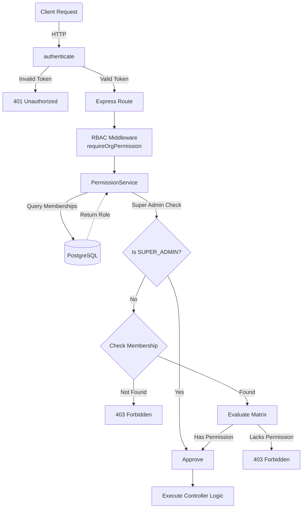

# Symbio Enterprise RBAC Engine

This document details the Role-Based Access Control (RBAC) authorization engine implemented for Symbio.

## 1. RBAC Matrix

The system separates permissions into three isolated scopes to ensure multi-tenant security and minimize privilege escalation vectors.

### System Roles

| Role | Scope | Implicit Permissions |
|---|---|---|
| **SUPER_ADMIN** | Global | Bypasses all Workspace and Organization checks. Full global read/write. |
| **USER** | Global | Default baseline. Access is delegated to Org/Workspace memberships. |

### Organization Permissions

| Permission | OWNER | ADMIN | MEMBER | GUEST |
|---|---|---|---|---|
| `canViewOrganization` | ✅ | ✅ | ✅ | ✅ |
| `canEditOrganization` | ✅ | ✅ | ❌ | ❌ |
| `canInviteUsers` | ✅ | ✅ | ❌ | ❌ |
| `canManageMembers` | ✅ | ✅ | ❌ | ❌ |
| `canDeleteOrganization` | ✅ | ❌ | ❌ | ❌ |

### Workspace Permissions

| Permission | ADMIN | EDITOR | VIEWER |
|---|---|---|---|
| `canViewWorkspace` | ✅ | ✅ | ✅ |
| `canEditWorkspace` | ✅ | ✅ | ❌ |
| `canDeleteWorkspace` | ✅ | ❌ | ❌ |
| `canManageWorkspaceMembers` | ✅ | ❌ | ❌ |

---

## 2. Permission Flow

When an HTTP request enters the Symbio backend, it follows this middleware pipeline:

1. **`authenticate`**: Verifies the `Authorization: Bearer <token>` header, decodes the JWT, and attaches the `userId` to the request payload.
2. **`requireVerifiedUser`** *(Optional)*: Rejects access if the user's email has not been verified.
3. **RBAC Middleware**: Extracts the `organizationId` or `workspaceId` dynamically from `req.params`, `req.body`, or `req.query`.
4. **`PermissionService`**:
   - Checks if the user is a `SUPER_ADMIN`. If true, automatically approves the request.
   - Otherwise, queries the database for the user's membership to the requested entity (`OrganizationMembership` or `WorkspaceMembership`).
   - If membership is missing, it denies access immediately (Returns `403 Forbidden`).
   - If membership exists, it evaluates the `Role` against the requested static Permission Matrix using `Set.has()`.
5. **Controller Implementation**: Receives the request with full assurance that the caller is authorized to perform the action.

---

## 3. Architecture Overview

